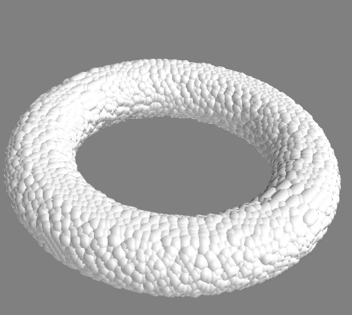
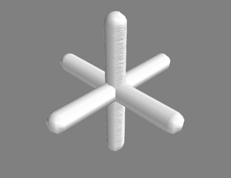

****************
Creating Targets
****************

Making target creation simple is one of the goals of ScatPy. Target class definitions
reside in the module :mod:`targets`. One important distinction between the way
that targets in ScatPy behave vs. DDSCAT is that in ScatPy targets always
have a defined physical size (either through ``aeff`` or physical dimensions).
Different size targets can be computed in one run by scaling the target through
a range of values. More on this in the section on Settings.

Generic Targets
===============
A generic target, based on the class :class:`targets.Target` is the one that
most closely mimics the internal DDSCAT
representation. It is created by simply specifying the same four pieces of
information used by DDSCAT: a shape directive, the shape parameters, the composition,
and the ``aeff``.::

>>> from ScatPy import *
>>> t = targets.Target('TRNGLPRSM', (10, 1, 1, 10), 'Au_evap', 0.100) 

Builtin Targets
===============
Builtin targets are ones that correspond to the standard target types defined
by DDSCAT internally. Dedicated classes exist for these target types which use
the same name as the corresponding DDSCAT directive. An important feature of these
targets is that they work in physical units, so again, targets have well defined
sizes. 

The following creates a prolate sphereoid with total length 1.0um, and
a rod with spherical endcaps with the same overall length.

>>> elps = targets.ELLIPSOID((0.5, 0.2, 0.2), 'Au_evap')
>>> rod = targets.CYLNDRCAP(0.8, 0.1)

In DDSCAT the physical size of the target is determined by the number of dipoles
and a_eff. The dipole spacing is inferred from these two. ScatPy does this the
other way around: target geometry is defined according to physical dimensions,
and the effective radius is calculated based on those dimensions and the dipole
spacing. So, for example::

>>> sphere = targets.ELLIPSOID((1,1,1), d=0.010)
>>> sphere.d
0.01
>>> sphere.aeff
0.9999999837036163
>>> sphere.N
4188790
>>> sphere.d = 0.001  # Change the target's dipole spacing 
>>> sphere.aeff       # No change to aeff...
0.9999999999374206
>>> sphere.N          # but the number of dipoles has increased
4188790204
    

Custom Targets
==============
Custom targets correspond to the ``FROM_FILE`` target directive in DDSCAT which
reads the geometry from a ``shape.dat`` file supplied by the user. ScatPy
endeavours to simplify the creation of such targets.

Generating from a function
^^^^^^^^^^^^^^^^^^^^^^^^^^
The simplest method to build a custom shape is to use the ``fromfunction`` method 
of :class:`FROM_FILE`. To do this, first create a function that will accept
arrays of the ``x,y,z`` pixels in the target volume (in units of um), and returns
an integer corresponding to composition (1 for material 1, 0 for vacuum). It
can accept further optional keyword arguments. Then call ``FROM_FILE.fromfunction``
with parameters corresponding to the generator function, and two points representing
the corners of the volume within which you wish to evaluate the function. See
the documentation for numpy.fromfunction for further details on how to write
generating functions.::

    def torus(x, y, z, R=0.5, r=0.1):
       """Build a torus"""
       rsq = (R - np.sqrt(x**2+y**2))**2 + z**2
       return np.where(rsq<r**2, 1, 0)
    t = targets.FROM_FILE.fromfunction(torus, (-1,-1,-1), (1,1,1))

If `mayavi <http://code.enthought.com/projects/mayavi/>`_ is installed custom
targets can be viewed using the ``show`` method::

    t.show()

 
Custom Classes
^^^^^^^^^^^^^^
Custom targets are subclassed from :class:`FROM_FILE` and provide a specialized
interface to a unique target geometry. For instance ScatPy includes a custom
target for creating helices, based on their ``height``, ``pitch``, and major
and minor radii: ``major_r`` and ``minor_r``.::

    helix = targets.Helix(1.0, 0.5, 0.3, 0.15)
    helix.show()

.. image:: 3Dhelix.png

It is possible to write your own custom class derived from :class:`FROM_FILE`.
The heart of such a class is a 3D grid representing possible dipole positions.
The value at each grid point indicates the material (a 3-tuple for each point
can be used for anisotropic compositions). The class must translate between the
physical units used to define the object, and the dipole units used to define
the grid. Here's a simple example that creates a class for building three
crossing wires resembling toy `jacks <http://en.wikipedia.org/wiki/Jacks_(game)>`_::

    class Jack(targets.FROM_FILE):
        """Three equal length wires arranged at right angles"""

        def __init__(self, length, *args, **kwargs):
            targets.FROM_FILE.__init__(self, *args, **kwargs)
        
            self.description='A three wire jack'            
            d_length = int(length/self.d)

            self.grid = np.zeros((d_length,)*3, dtype=int)

            mid = int(d_length/2)
            self.grid[:,mid,mid]=1
            self.grid[mid,mid,:]=1
            self.grid[mid,:,mid]=1

    target = Jack(1.0)
    target.show()

